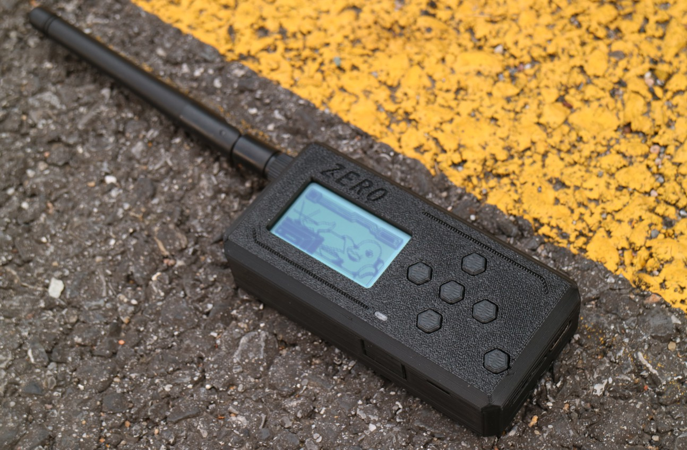

# 
ZERO

Welcome here, and thank you all for your support. This is the public directory of the Zero project, where some files will be gradually open-sourced.

> [!IMPORTANT]
> Statement: If you like the FlipperZero project and have sufficient financial ability, please purchase the original device through official channels. Building such a strong community is not easy, and we appreciate that they have open-sourced a large amount of materials. My device is not intended for counterfeiting or piracy. It includes targeted modifications and uses a completely new exterior design for clear distinction. The enclosure is fully incompatible with the original device. The purpose is to create a more affordable device and promote better development of the project.

> [!IMPORTANT]
> Additional statement: The device is intended only for legal technical learning and lawful analysis and testing by professionals (you should know what you are doing).

[Shell_Modell](./Shell_Model)
The shell model files are now available. You can print a more attractive ⭐ and personalized 😎 enclosure for yourself!

This is my YouTube channel
[Youtube](https://www.youtube.com/channel/UCHENkZK1oac_hoAVk4aAufA)

This is my BiliBili channel
[BiliBili](https://space.bilibili.com/150167463)

If you are seeking business collaboration or advice regarding a project, you can contact me via email.
[Email](xiao_hei666@yeah.net)